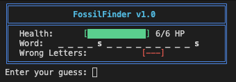
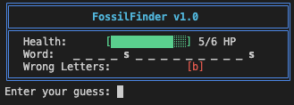
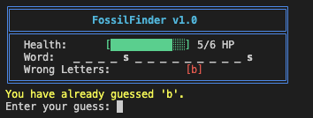
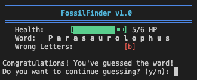
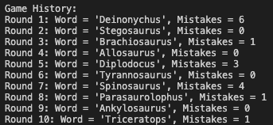
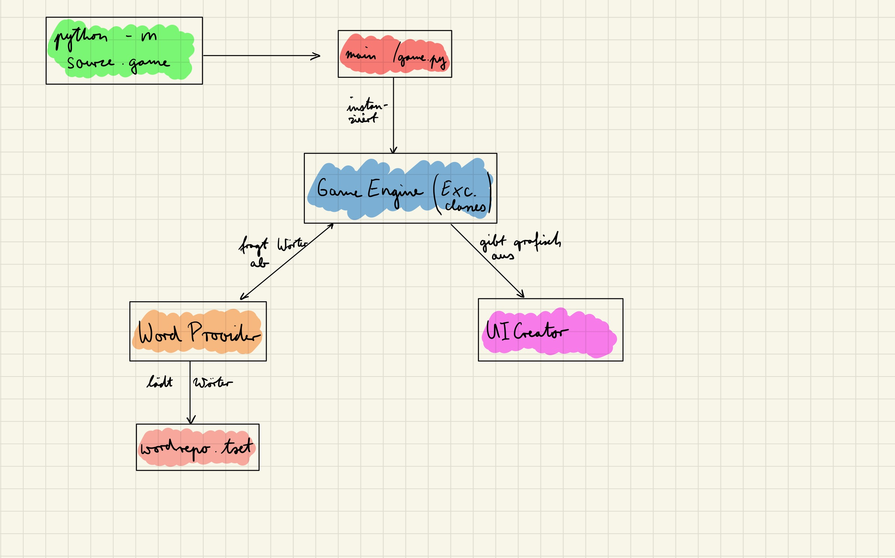
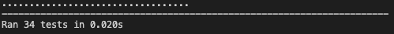
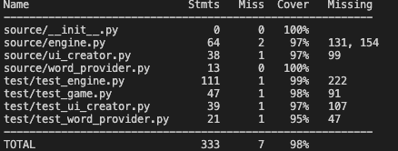
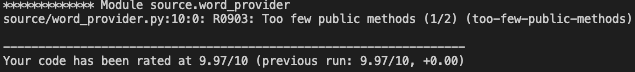

# FossilFinder v1.0
## Spielkonzept
Das Spiel `FossilFinder` ist ein Wortratespiel. Das Ziel des Spielers ist es, den Namen eines Dinosauriers zu erraten. Hierbei hat er eine begrenzte Anzahl an Rateversuchen, um das Rätsel zu entschlüsseln. Dabei kann der Spieler versuchen, einzelne Buchstaben oder das gesamte Wort zu erraten. Er gewinnt, wenn er das gesuchte Wort mit weniger als 6 Fehlversuchen entschlüsselt. 

## Spielmechanik
Das Spiel wird gestartet über:
```cmd
python3.14 -m source.game
```

Beim ersten Versuch in diesem Fall der Buchstabe `s` geraten.



Im nächsten Versuch wird der Buchstabe `b` geraten. Dieser Buchstabe ist jedoch nicht im Wort enthalten.



Wie man beim zweiten Versuch erkennen kann, wird dem Benutzer dieses Spiels angezeigt, welche Buchstaben in dem gesuchten Wort enthalten sind und welche Buchstaben eben nicht. Rät man einen Buchstaben falsch, so wird dem Spieler für diese Spielrunde ein `Lebenspunkt` abgezogen. Diese Lebenspunkte spiegeln die 6 Fehlversuche wider, die ein Spieler pro Spielrunde maximal erhalten darf. Welche Buchstaben er richtig geraten hat, sieht der Spieler in dem aufgedeckten Wort. Der Spieler erhält zudem eine Auflistung an Buchstaben, die er geraten hat, aber nicht in dem gesuchten Dinosauriernamen sind.

Wird ein Buchstabe doppelt geraten, so erhält der Spieler eine dazu passende Information. Dies wird nicht als Fehlversuch gewertet.



Der Nutzer hat auch die Möglichkeit, ein gesamtes Wort zu erraten. Rät er falsch, so wird dem Spieler lediglich ein Lebenspunkt abgezogen. Für den Fall, dass er richtig rät, hat er gewonnen, sofern seine 'Lebenspunkte' nicht aufgebraucht sind. In diesem Spiel ist das richtige Lösungwort `Parasaurolophus`.



Danach kann sich der Spieler entscheiden, ob er erneut Raten oder ob er das Ratespiel beenden möchte. Pro Start des Spiels sind 10 Ratespiele erlaubt. Werden die 10 Spiele erreicht, so endet das Spiel automatisch.
Das Verlassen ist - wie oben beschrieben - nur nach jeder abgeschlossenen Runde erlaubt. Der Grund dafür ist, dass die einzelnen Spielrunden gespeichert werden und dem Spieler am Ende dargestellt werden. Ich habe mich gegen den Abbruch in der Mitte eines Spiels entschieden, damit ich die Spielhistorie einheitlich darstellen kann. Zudem kann man ein Spiel recht schnell beenden, wenn man Buchstaben wie `ä`, `ö` etc. rät, die in Dinosauriernamen tendenziell seltener zu finden sind.

Nach 10 Spielen sieht der Spielverlauf dann folgendermaßen aus:



# Architekturbeschreibung
## Projektstruktur
Das Projekt wurde aus den Vorgaben entnommen. Im Hauptverzeichnis `FossilFinder` liegt die `mypy.ini` - Datei, sowie die Paketanforderungen `requirements.txt` als auch die `README.md`.
Des weiteren befinden sich die drei Verzeichnisse 
- `documentation` mit der gesamten Dokumentation,
- `source` mit den gesamten Spieldateien und
- `test` mit den Testdateien

in dem Hauptverzeichnis.

Das Spiel lässt sich, wie oben beschrieben, starten. In der `game.py` Datei ist die Spielschleife. Diese nutzt die Klasse `GameEngine`, die dann jeweils eine Instanz der Klassen `UICreator` und `WordProvider` enthält. Alle drei Klassen sind in drei seperaten Dateien gespeichert.
Zu den jeweiligen Klassen in den Dateien gibt es dann zugehörige Testdateien, die im `test` Ordner liegen. Die Testdatei hat dann einen angehängten Prefix mit `test_`, um die Zugehörigkeit deutlich zu machen.

Im unteren Schaubild ist die Projektstruktur aufgeschlüsselt:
```
FossilFinder/
├── documentation/
    ├── md/
    ├── word/
    ├── documentation.pdf
    └── Selbsteinschätzung.xlsx
├── source/
    ├── __init__.py
    ├── engine.py
    ├── game.py
    ├── ui_creator.py
    ├── word_provider.py
    └── wordrepo.txt
├── test/
    ├── __init__.py
    ├── test_engine.py
    ├── test_game.py
    ├── test_ui_creator.py
    └── test_word_provider.py
├── .pylintrc
├── LICENSE
├── mypy.ini
├── README.md
└── requirements.txt
```

## Hauptmodule
### game.py
Mit der Ausführung von `game.py` wird das eigentliche Projektspiel gestartet. In dieser Datei befindet sich lediglich die Spielschleife. Diese Spielschleife ist dafür zuständig, die Nutzereingaben an die `GameEngine` Klasse weiterzugeben und die Rückgaben dieser Klasse zu verarbeiten. Sollte das Spiel gewonnen, verloren, Fehler geworfen oder das Spiel frühzeitig beendet werden, so wird dies in der Spielschleife verarbeitet. Dennoch ist die Aufgabe der Spielschleife, dass sie die Daten aus der GameEngine Klasse verarbeitet.

### GameEngine und Fehlerklassen
Die `GameEngine` Klasse mit ihren Fehlerklassen ist das Herzstück dieses Ratespiels. Hier ist die Verbindung mit dem Spieler und dessen Eingaben, dem Wortspeicher und der grafischen Ausgabe für den User.

#### Fehlerklassen
- `InvalidGuessError`: Ist in einem Wort oder einem einzelnen Buchstaben bspw. ein Symbol wie `@`, dann geht man davon aus, dass sich der Spieler vermutlich vertippt hat und es sich somit um einen inkorrekten Versuch handelt, der nicht als Fehler gilt.
- `LetterGuessedError`: Wird ein Buchstabe vom Spieler erneut geraten, so wird dieser Fehler geworfen.

Beide Fehlerklassen hätten sich theoretisch vereinen lassen können, da sie nicht seperat, sondern beide zusammen in `game.py` behandelt werden. Eine Alternative wäre gewesen, dass man beide Fehlerklassen als `ValueError` interpretiert. Der Grund, warum ich mich für zwei Fehlerklassen entschieden habe ist, dass sich beide schematisch voneinander trennen lassen. Schlussendlich hat diese Trennung den Vorteil, wenn man später getrennt voneinander beide Fehlerarten testen kann. Hierbei lässt sich dann wiederum unterscheiden, um welchen Fehlerfall es sich handelt. Ein weiterer Grund für die Trennung wäre, dass man die beiden Exceptions in der Spieleschleife getrennt voneinander fängt und dann eine passende Ausgabe macht. Da eine visuelle Ausgabe für den Spieler schon vor dem Werfen des jeweiligen Fehlers stattfindet, wird die Unterscheidung jedoch nicht gebraucht.

#### GameEngine
Diese Klasse speichert alle spielspezifischen Daten, wie die Rundenanzahl, den Spielverlauf oder die fehlerhaften Buchstaben des aktuellen Spiels. Zudem enthält sie wie bereits angesprochen je eine Instanz der Klassen `UICreator` und `WordProvider`. 

Die GameEngine Klasse enthält 8 Methoden:

- `next_round(self) -> bool`: Diese Methode gibt einen Wahrheitswert zurück und zwar, ob eine weiter Runde gespielt werden darf oder ob das Limit der Spiele schon erreicht ist. Falls es keine Wörter mehr geben würde, gibt die Methode das auch zurück. Diese Methode wird von der Spielschleife nach einem abgeschlossenen Spiel abgefragt (wenn der Spieler weiterspielen möchte). Sollte das Limit der maximalen Runden nicht erreicht sein, so werden die Spielvariablen wie die `Fehleranzahl` zurückgesetzt und ein neues, zufälliges Wort wird vom `WordProvider` abgefragt.

- `make_guess(self, guess: str) -> None`: Diese Methode wird ebenfalls von der Spieleschleife angesteuert und verarbeitet die Eingabe des Spielers. 
Es gibt drei Möglichkeiten für eine Eingabe eines Benutzers:

    - ein ganzes Wort wird geraten
    - ein einzelner Buchstabe wird geraten
    - der Rateversuch enthält ein ungültiges Zeichen

    Zudem wird hier die Befehle für eine grafische Ausgabe an den UICreator gegeben.

- `print_status(self) -> None`: Die Methode wird aufgerufen, wenn eine akzeptierte Eingabe des Spielers stattgefunden hat. Hiermit wird dann der Spielstand für den Spieler ausgegeben. Sollte eine fehlerhafte Eingabe des Spielers erfolgt sein, so wird die Ausgabe seperat übernommen.

- `word_guessed(self) -> bool`: Diese Methode gibt einen Wahrheitswert zurück, ob das gesamte Wort erraten wurde.

- `save_game(self) -> None`: Nach dem Verlieren oder Meistern eines Spieles wird diese Methode aufgerufen, um die Fehler, Rundennummer und das Wort zu speichern. Diese Daten werden für eine Darstellung des Spielverlaufs schlussendlich benötigt.

- `failed(self) -> bool`: Werden 6 Fehlversuche vom Spieler gemacht, so gibt diese Methode den Wahrheitswert `True` zurück.

- `print_fail_message(self) -> None`: Diese Methode wird aufgerufen, wenn der Spieler das Wort nicht erraten konnte.

- `print_game_history(self) -> None`: Hier wird der Spielverlauf der vorrausgegangenen Spiele ausgegeben.

Die letzten beiden Methoden sind nicht in der UICreator Klasse, da so die Daten einfach weitergegeben würde. Dies ist zwar von der Performance her relativ egal, ist aber unnötig und unkompliziert.

### UICreator
Die UICreator Klasse beinhaltet fast ausschließlich jede grafische Ausgabe für den Spieler. Sie enthält Variablen für farbliche Ausgaben.

- `display_status(...) -> None`: Das "Card" - Design der Ausgabe wird hier kreeirt. Der Sinn dieser tabellarischen Ausgabe ist es, möglichst kompakt und übersichtlich, dem Spieler den aktuellen Spielstand zu übermitteln. Dabei werden unterschiedliche Farben genutzt, um zum Beispiel die Aufmerksamkeit auf den Lebensbalken (dieser ändert die Farbe von Grün zu Rot) oder die falschen Buchstaben zu lenken. 

- `clear_screen(self) -> None`: Unter anderem nach dem Rateversuch wird der Bildschirm des Terminals in einer Art $gelöscht$. Das dient hauptsächlich dazu, dass der Spieler immer nur auf eine Stelle auf seinem Bildschirm gucken muss. Dies trägt dann zu einem besseren Spielerlebnis bei.

- `print_letter_guessed(self, letter: str) -> None`: Wird ein Buchstabe mehrfach geraten, so wird das dem Spieler mithilfe dieser Methode rückgemeldet. Die Nachricht wird mit der Signalfarbe gelb hervorgehoben.

- `print_invalid_guess(self, guess: str) -> None`: Diese Methode ist ähnlich zur Methode print_letter_guessed, nur mit dem Unterschied, dass fälschlicherweiße die Benutzereingabe ein nicht alphabetisches Zeichen enthält.

### WordProvider und wordrepo.txt
Die WordProvider Klasse beinhaltet die Wörter aus dem Wortspeicher. Sie stellt sicher, dass jedes Wort nur einmal in einem Spiel vorkommen kann. 

- `__init__.py(self, file_name: str) -> None`: Diese Methode sucht in dem Verzeichnis nach dem Namen für die Wortspeicherdatei, in dem es selbst liegt. Aus dieser Datei werden dann alle Wörter in einem Set gespeichert, sodass sichergestellt wird, dass jedes Wort einmalig ist. 

- `get_random_word(self) -> str`: Mithilfe von random.choice wählen wir ein zufälliges Wort aus dem set aus. Im nächsten Schritt wird dieses ausgewählte Wort aus dem set gelöscht, damit es nur einmal ausgewählt werden kann. Dieses Wort erhält dann die GameEngine.

## Zusammenspiel der Module



# Benutzerinteraktion
Der Spieler innerhalb eines Spiels wird so lange nach Eingaben gefragt, bis der Spieler entweder die Lösung gefunden hat oder eben nicht. Nach jeder abgeschlossenen Runde wird abgefragt, ob der Nutzer eine weitere Runde spielen möchte. Dies geht jedoch nur so lange, bis der Spieler die maximale Anzahl an Spielen erreicht hat.

# Ergebnisse
In diesem Kapitel werden die Ergebnisse von den Unittests, Coverage, Pylint und MyPy dargestellt.

## Unittests


Für jedes Dokument aus dem `source` Ordner wurde eine Testdatei erstellt. Ich habe mich schwer getan, zu entscheiden, wie ich es mit der `game.py` handhabe, da ich hier eigentlich nur teste, inwiefern die `GameEngine` funktioniert. Dennoch habe ich mich dazu entschieden für jeden Fall, für den man aus einer der doppelten while - Schleife ausbricht, zu testen, ob es ein Szenario gibt, für den dann aus der while - Schleife ausgebrochen wird. Damit teste ich, ob hier eine der beiden Schleifen eine Endlosschleife ist. Dennoch teste ich quasi doppelt (einmal in **test_engine.py** und einmal in **test_game.py**) und habe somit eine gewisse Redundanz in der Programmierung.

## Coverage


## MyPy


## Pylint


Pylint prüft die Codequalität. Bis auf die Klasse `WordProvider` scheint der Code in Ordnung zu sein. Da man bis zu 3 individuelle Anpassungen vornehmen darf, entscheide ich mich für die einzige Anpassung bei dieser Klasse. Dafür habe ich für pylint `too-few-public-methods` bei dieser Klasse deaktiviert.

**Begründung:** Die Klasse `WordProvider` hat nur eine Methode, da sie nicht mehr braucht. Eine Alternative wäre, die Wörter in der Engine zu speichern oder eine Funktion nutzen. Gegen die erste Alternative spricht, dass die GameEngine Klasse sowieso schon relativ groß ist. Dies merkt man daran, dass ich mit 20 Methoden bei der zugehörigen Testklasse schon fast an die genau entgegengesetzte Grenze stoße (`too-many-public-methods`). Im Allgemeinen instanziieren wir die Klasse einmal und können durch die einzige Methode jedes Mal ein neues Wort auswählen lassen. Dabei haben wir den Zugriff auf die .txt - Datei getrennt von den anderen Prozessen und dies mit einer schlanken Klasse, die sich dadurch auch noch leicht testen lässt. Das spricht auch gegen die zweite Alternative eine Funktion zu wählen.

# Versionsangaben
Ich habe folgende Versionen genutzt.

- Umgebung:
    - macOS Tahoe 26.4
    - Terminal: zsh und bash
    - Editor: Visual Studio Code
    - Python (venv): 3.12.12
- Pakete:
    - MyPy: 1.19.1
    - Coverage: 7.13.5
    - Pylint: 4.0.5

# KI Nutzung
|Werkzeug|Einsatz|
|---|---|
|**Gemini**|Ich habe Gemini genutzt, um Ideen zu sammeln für ein Spielthema. Zudem konnte ich mir mithilfe der KI eine größere Menge an Dinosauriernamen in Erfahrung bringen, ohne einen größeren Aufwand betreiben zu müssen. Des Weiteren habe ich Gemini die Struktur des Projektkonzepts überprüfen lassen. Da ich in vorherigen Abgaben hauptsächlich Funktionen und keine Klassen verwendet habe (außer bei den Abgaben, bei den das konkret in den Anforderungen stand), habe ich mich für die 3 Klassen entschieden. Aber auch Informationen, z.B. wie ich eine farbige Ausgabe gestalten kann, habe ich von Gemini.|

# Quellen

- Real-Python für Unittest: https://realpython.com/python-unittest
- Vorlesungsmaterial